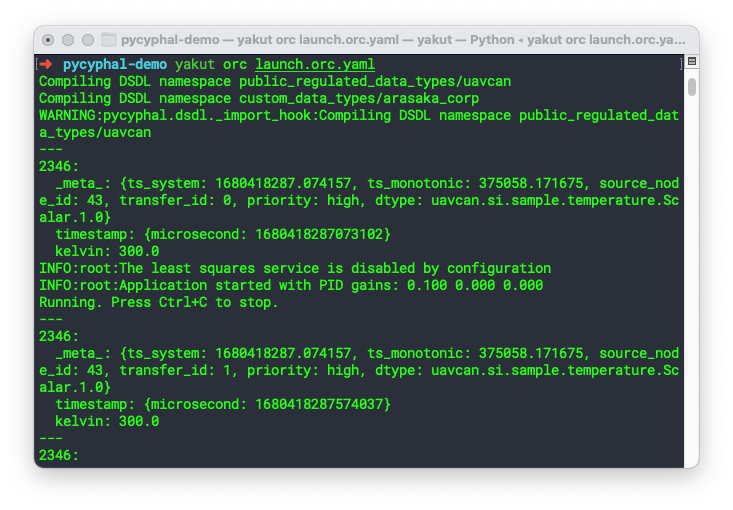

# pycyphal demo

- [pycyphal demo](#pycyphal-demo)
  - [Setup](#setup)
  - [Definining data types](#definining-data-types)
  - [Setup a node](#setup-a-node)
  - [Inspecting the node using Yakut](#inspecting-the-node-using-yakut)
    - [Message interface](#message-interface)
    - [Register interface](#register-interface)
    - [Service interface](#service-interface)
  - [Adding a second node](#adding-a-second-node)


The best way to get accustomed with OpenCyphal is to start with pycyphal, which is the (full) protocol implemented in Python. To do this you don't need any additional hardware, everything will be run locally on your computer using loopback to communicate between different nodes.

## Setup

- install pycyphal
- install yakut

## Definining data types

> Before we can setup nodes, send messages and run services, we need to define what *exactly* our messages/services will be messaging and servicing. (Exactly means statically defined in this context.)

Start by creating an empty folder in your home directory called `pycyphal-demo`.

```bash
mkdir pycyphal-demo
```

Next, we'll need to add the standard DSDL definitions, which are required for every Cyphal node, as they implement the necessary definitions for the core protocol. To do this, just close the following repository into the recently created `pycyphal-demo` folder.

```bash
cd ~/pycyphal-demo
git clone https://github.com/OpenCyphal/public_regulated_data_types
```

As we're interested in implementing some additional messages/services, we'll also need to have some additional DSDL definitions for those. To do this, create a seperate folder called `custom_data_types`, which will contain all the DSDL specifications related to our specific usecase/implementation.

```bash
cd ~/pycyphal-demo
mkdir custom_data_types
```

Now let's assume we bought a component from Arasaka Corporation, to integrate this component into our robotics system, it requires using 1 message type and 1 service type. 

Our folder directory structure should start to look like this:

```bash
custom_data_types/
    arasaka_corp/
        PerformLinearLeastSquaresFit.1.0.dsdl   # service type definition
        PointXY.1.0.dsdl                        # nested message type definition
public_regulated_data_types/
    uavcan/
        ...
    ...
```

`PerformLinearLeastSquaresFit.1.0.dsdl`:

```bash
# This service accepts a list of 2D point coordinates and returns the best-fit linear function coefficients.
# If no solution exists, the returned coefficients are NaN.

PointXY.1.0[<64] points

@extent 1024 * 8    # 16 * 2 * 64 * 4

---

float64 slope
float64 y_intercept

@extent 64 * 8      # 64 * 2 * 4
```

`PointXY.1.0.dsdl`:

```
float16 x
float16 y
@sealed
```

The description in the comments provides a basic understanding to the end customer, however some additional notes on how to read these DSDL files:

- `---` denotes the seperation between the Request part of the service and the Response part. In this case the Request part will contain some number (never larger than 64) of points (whose type we shall define next). The response part will consist of 2 numbers, both of the type `float64`. 
- `@extent` is used in order the define the size of the message. To understand where this exact number is coming from:
  - Request:
    - `16 * 2`: PointXY consists of two 16-bit floats
    - `* 64`: max size of list
    - `* 4`: additional buffering
  - Response:
    - `64 * 2`: two 64-bit floats
    - `* 4`: additional buffering

{: .warning}
> The difference between `@extent` and `@sealed` is a crucial one to understand, a more in-depth is given in Section 3.4.5.5 of the [Cyphal Specification](https://opencyphal.org/specification/Cyphal_Specification.pdf).
>
> For those too lazy to look it up, here is the most relevant passage:
> 
> As detailed in Section 3.8, data types may evolve over time to accommodate new design requirements, new features, to rectify issues, etc. In order to allow gradual migration of deployed systems to revised data types, it is desirable to ensure that they can be modified in a way that does not render new definitions incompatible with their earlier versions. In this context there are two related concepts:
> - **Extent** -- the minimum amount of memory, in bits, that shall be allocated to store the serialized respresentation of the type. The extent of any type is always greater than or equal the maximum value of its bit length set. It is always a multiple of 8. 
> - **Sealing** -- a type that is *sealed* is non-evolvable and its extent equals the maximal value of its bit length set. A type that is not sealed is also referred to as *delimited*.

To put it in simple terms, these are the trade-offs you'll need to keep in mind:
- Extent types give the ability to the developer to *extend* (duh) the functionality (type fields specifically) at a later date, while keeping compatibility with the (already) deployed, possibly, large number of components in the field. This benefit cannot be underestimated, as finding yourself in the opposite situation can be quite a headache: millions of components deployed, with no way of addressing some mistake/evolving the functionality.
- The case where it *does* make sense to opt for a Sealed type, is when:
  - Bandwidth usage is extremely critical.
  - You are 120% sure there will be no extensions of the functionality in the future. For example: it is hard to image that the interface to a temperature sensor might require some drastic changes? This will be mostly limited to small functional blocks, not so much for the more complicated ones.

## Setup a node

> Now that we have defined some message and data types, we can get to actually setting up our first Cyphal node.

In `pycyphal-demo`, create a file named `demo_app.py`:

<details>
<summary>demo_app.py</summary>

```py
import os
import sys
import pathlib
import asyncio
import logging
import pycyphal

# DSDL files are automatically compiled by pycyphal import hook from sources pointed by CYPHAL_PATH env variable.
import arasaka_corp  # This is our vendor-specific root namespace. Custom data types.
import pycyphal.application  # This module requires the root namespace "uavcan" to be transcompiled.

# Import other namespaces we're planning to use. Nested namespaces are not auto-imported, so in order to reach,
# say, "uavcan.node.Heartbeat", you have to "import uavcan.node".
import uavcan.node
import uavcan.si.sample.temperature
import uavcan.si.unit.temperature
import uavcan.si.unit.voltage


class DemoApp:
    REGISTER_FILE = "demo_app.db"
    """
    The register file stores configuration parameters of the local application/node. The registers can be modified
    at launch via environment variables and at runtime via RPC-service "uavcan.register.Access".
    The file will be created automatically if it doesn't exist.
    """

    def __init__(self) -> None:
        node_info = uavcan.node.GetInfo_1.Response(
            software_version=uavcan.node.Version_1(major=1, minor=0),
            name="org.opencyphal.pycyphal.demo.demo_app",
        )
        # The Node class is basically the central part of the library -- it is the bridge between the application and
        # the Cyphal network. Also, it implements certain standard application-layer functions, such as publishing
        # heartbeats and port introspection messages, responding to GetInfo, serving the register API, etc.
        # The register file stores the configuration parameters of our node (you can inspect it using SQLite Browser).
        self._node = pycyphal.application.make_node(node_info, DemoApp.REGISTER_FILE)

        # Published heartbeat fields can be configured as follows.
        # From the [Cyphal guide](https://forum.opencyphal.org/t/the-cyphal-guide/778/4):
        #   The public regulated data types define certain standard application-level functions such as the
        #   heartbeat message `uavcan.node.Heartbeat`, the only application-level function that 
        #   **every Cyphal node** is required to support.
        #   Except for publishing a Heartbeat once a second, every other application-level function
        #   is optional and can be implemented at the disceretion (or lack thereof) of the designer.
        self._node.heartbeat_publisher.mode = uavcan.node.Mode_1.OPERATIONAL
        self._node.heartbeat_publisher.vendor_specific_status_code = os.getpid() % 100

        # Now we can create ports to interact with the network.
        # They can also be created or destroyed later at any point after initialization.
        # A port is created by specifying its data type and its name (similar to topic names in ROS or DDS).
        # The subject-ID is obtained from the standard register named "uavcan.sub.temperature_setpoint.id".
        # It can also be modified via environment variable "UAVCAN__SUB__TEMPERATURE_SETPOINT__ID".
        self._sub_t_sp = self._node.make_subscriber(uavcan.si.unit.temperature.Scalar_1, "temperature_setpoint")

        # As you may probably guess by looking at the port names, we are building a basic thermostat here.
        # We subscribe to the temperature setpoint, temperature measurement (process variable), and publish voltage.
        # The corresponding registers are "uavcan.sub.temperature_measurement.id" and "uavcan.pub.heater_voltage.id".
        self._sub_t_pv = self._node.make_subscriber(uavcan.si.sample.temperature.Scalar_1, "temperature_measurement")
        self._pub_v_cmd = self._node.make_publisher(uavcan.si.unit.voltage.Scalar_1, "heater_voltage")

        # Create an RPC-server. The service-ID is read from standard register "uavcan.srv.least_squares.id".
        # This service is optional: if the service-ID is not specified, we simply don't provide it.
        try:
            srv_least_sq = self._node.get_server(arasaka_corp.PerformLinearLeastSquaresFit_1, "least_squares")
            srv_least_sq.serve_in_background(self._serve_linear_least_squares)
        except pycyphal.application.register.MissingRegisterError:
            logging.info("The least squares service is disabled by configuration")

        # Create another RPC-server using a standard service type for which a fixed service-ID is defined.
        # We don't specify the port name so the service-ID defaults to the fixed port-ID.
        # We could, of course, use it with a different service-ID as well, if needed.
        self._node.get_server(uavcan.node.ExecuteCommand_1).serve_in_background(self._serve_execute_command)

        self._node.start()  # Don't forget to start the node!

    @staticmethod
    async def _serve_linear_least_squares(
        request: arasaka_corp.PerformLinearLeastSquaresFit_1.Request,
        metadata: pycyphal.presentation.ServiceRequestMetadata,
    ) -> arasaka_corp.PerformLinearLeastSquaresFit_1.Response:
        logging.info("Least squares request %s from node %d", request, metadata.client_node_id)
        sum_x = sum(map(lambda p: p.x, request.points))
        sum_y = sum(map(lambda p: p.y, request.points))
        a = sum_x * sum_y - len(request.points) * sum(map(lambda p: p.x * p.y, request.points))
        b = sum_x * sum_x - len(request.points) * sum(map(lambda p: p.x**2, request.points))
        try:
            slope = a / b
            y_intercept = (sum_y - slope * sum_x) / len(request.points)
        except ZeroDivisionError:
            slope = float("nan")
            y_intercept = float("nan")
        return arasaka_corp.PerformLinearLeastSquaresFit_1.Response(slope=slope, y_intercept=y_intercept)

    @staticmethod
    async def _serve_execute_command(
        request: uavcan.node.ExecuteCommand_1.Request,
        metadata: pycyphal.presentation.ServiceRequestMetadata,
    ) -> uavcan.node.ExecuteCommand_1.Response:
        logging.info("Execute command request %s from node %d", request, metadata.client_node_id)
        if request.command == uavcan.node.ExecuteCommand_1.Request.COMMAND_FACTORY_RESET:
            try:
                os.unlink(DemoApp.REGISTER_FILE)  # Reset to defaults by removing the register file.
            except OSError:  # Do nothing if already removed.
                pass
            return uavcan.node.ExecuteCommand_1.Response(uavcan.node.ExecuteCommand_1.Response.STATUS_SUCCESS)
        return uavcan.node.ExecuteCommand_1.Response(uavcan.node.ExecuteCommand_1.Response.STATUS_BAD_COMMAND)

    async def run(self) -> None:
        """
        The main method that runs the business logic. It is also possible to use the library in an IoC-style
        by using receive_in_background() for all subscriptions if desired.
        """
        temperature_setpoint = 0.0
        temperature_error = 0.0

        def on_setpoint(msg: uavcan.si.unit.temperature.Scalar_1, _: pycyphal.transport.TransferFrom) -> None:
            nonlocal temperature_setpoint
            temperature_setpoint = msg.kelvin

        self._sub_t_sp.receive_in_background(on_setpoint)  # IoC-style handler.

        # Expose internal states to external observers for diagnostic purposes. Here, we define read-only registers.
        # Since they are computed at every invocation, they are never stored in the register file.
        self._node.registry["thermostat.error"] = lambda: temperature_error
        self._node.registry["thermostat.setpoint"] = lambda: temperature_setpoint

        # Read application settings from the registry. The defaults will be used only if a new register file is created.
        gain_p, gain_i, gain_d = self._node.registry.setdefault("thermostat.pid.gains", [0.12, 0.18, 0.01]).floats

        logging.info("Application started with PID gains: %.3f %.3f %.3f", gain_p, gain_i, gain_d)
        print("Running. Press Ctrl+C to stop.", file=sys.stderr)

        # This loop will exit automatically when the node is close()d. It is also possible to use receive() instead.
        async for m, _metadata in self._sub_t_pv:
            assert isinstance(m, uavcan.si.sample.temperature.Scalar_1)
            temperature_error = temperature_setpoint - m.kelvin
            voltage_output = temperature_error * gain_p  # Suppose this is a basic P-controller.
            await self._pub_v_cmd.publish(uavcan.si.unit.voltage.Scalar_1(voltage_output))

    def close(self) -> None:
        """
        This will close all the underlying resources down to the transport interface and all publishers/servers/etc.
        All pending tasks such as serve_in_background()/receive_in_background() will notice this and exit automatically.
        """
        self._node.close()


async def main() -> None:
    logging.root.setLevel(logging.INFO)
    app = DemoApp()
    try:
        await app.run()
    except KeyboardInterrupt:
        pass
    finally:
        app.close()


if __name__ == "__main__":
    asyncio.run(main())
```

</details>

Now before we can run the script above, we'll need to make sure we setup the following environment variables:
- `CYPHAL_PATH`: should contain a list to all the paths where the DSDL root namespace directories are to be found.
    ```bash
    export CYPHAL_PATH="$HOME/pycyphal-demo/custom_data_types:$HOME/pycyphal-demo/public_regulated_data_types"
    ```
- `registers`: registers are named values that keep various configuration parameters of the local Cyphal node.
    ```bash
    export UAVCAN__NODE__ID=42                           # Set the local node-ID 42 (anonymous by default)
    export UAVCAN__UDP__IFACE=127.0.0.1                  # Use Cyphal/UDP transport via localhost
    export UAVCAN__SUB__TEMPERATURE_SETPOINT__ID=2345    # Subject "temperature_setpoint"    on ID 2345
    export UAVCAN__SUB__TEMPERATURE_MEASUREMENT__ID=2346 # Subject "temperature_measurement" on ID 2346
    export UAVCAN__PUB__HEATER_VOLTAGE__ID=2347          # Subject "heater_voltage"          on ID 2347
    export UAVCAN__SRV__LEAST_SQUARES__ID=123            # Service "least_squares"           on ID 123
    export UAVCAN__DIAGNOSTIC__SEVERITY=2                # This is optional to enable logging via Cyphal
    ```
    In PyCyphal, registers are normally stored in the register file in the *register file*, in our case it's called `demo_app.db`. Once you've started the application with a specific configuration, it will store the values in the register file, so the next time you can run it without passing any environment variables at all.

    The registers of any Cyphal node are exposed to other network participants via the standard RPC-services defined in the standard DSDL namespace `uavcan.register`. This means that other nodes on the network can reconfigure our demo application via Cyphal directly. 

Once you've added these files, your folder directory structure should look as follows:

```bash
custom_data_types/
    arasaka_corp/
        PerformLinearLeastSquaresFit.1.0.dsdl   # service type definition
        PointXY.1.0.dsdl                        # nested message type definition
public_regulated_data_types/
    uavcan/
        ...
    ...
demo_app.py                                     # the demo script that sets up our node
my_env.sh                                       # the environment variables as discussed above
                                                # (CYPHAL_PATH and registers!)
```

Now let's try to run our Cyphal node:

```bash
cd ~/pycyphal-demo
source my_env.sh
python3 demo_app.py
```

If everything is set up correctly, you should see the following output:


Now, you should able to inspect the newly created `demo_app.db`:


## Inspecting the node using Yakut

> Now that we have a running node, we would like to be able to interact with it and see how it responds. This can be done using Yakut, a CLI tool for diagnostics and management of Cyphal networks. 

Before we can use yakut to inspect our node, it needs to know about the message/services it will interact with, and thus the first step is to compile our DSDL namespaces using `yakut compile`:

```
cd ~/pycyphal-demo
mkdir yakut_compile_output
cd yakut_compile_output
yakut compile ../custom_data_types/arasaka_corp ../public_regulated_data_types/uavcan
```

This will create 2 additional directories:

```bash
yakut_compile_output
    arasaka_corp/    # new directory 1
    uavcan/          # new directory 2
custom_data_types/
    arasaka_corp/
        PerformLinearLeastSquaresFit.1.0.dsdl
        PointXY.1.0.dsdl                     
public_regulated_data_types/
    uavcan/
        ...
    ...
demo_app.py                                  
my_env.sh                                                   
```

Now we need to set `YAKUT_PATH`, so it knows where to look for the compiled output:

```bash
export YAKUT_PATH=$HOME/pycyphal-demo/yakut_compile_output
```

`yakut` also needs to operate on the same network as the demo. Earlier we configured the demo to use Cyphal/UDP via the localhost interface. So, for Yakut, we can export this configuration to let it run on the same network anonymously:

```bash
export UAVCAN__UDP__IFACE=127.0.0.1  # We don't export the node-ID, so it will remain anonymous.
```

(It can be handy to store both of the above exports in a file called `yakut_setup.sh`).

Before we start listening/interacting with our node, let's take a step back and understand how this script actually looks like from a bird's-eye view. The following graph gives a clear visual overview of all the functionality that is contained within our node (which can be deducted from `demo_app.py` and the registers we have set):


Graph explanation:

- `42:org.opencyphal.pycyphal.demo.demo_app`:
  - `42`: set by `UAVCAN__NODE__ID`
  - `org.opencyphal.pycyphal.demo.demo_app`: defined in `demo_app.py`
- `heartbeat_publisher`
  - all heartbeats are published by default to `uavcan.node.heartbeat`
    - defined in `public_regulated_data_types`
- `temperature_setpoint`
  - `2345:uavcan.si.unit.temperature.Scalar_1`
    - subscribes to a `uavcan.si.unit.temperature.Scalar_1` type Message
      - defined in `public_regulated_data_types`
    - from Subject ID 2345
      - set by `UAVCAN__SUB__TEMPERATURE_SETPOINT_ID`
- `temperature_measurement`
  - `2346:uavcan.si.unit.voltage.Scalar`
    - subscribes to a `uavcan.si.sample.temperature.Scalar_1` type Message
      - defined in `public_regulated_data_types`
    - from Subject ID 2346
      - set by `UAVCAN__SUB__TEMPERATURE_MEASUREMENT__ID`
- `heater_voltage`
    - `2347:uavcan.si.unit.voltage.Scalar_1`
      - publishes a `uavcan.si.unit.voltage.Scalar_1` type Message
        - defined in `public_regulated_data_types`
      - to Subject ID 2347
        - set by `UAVCAN__PUB__HEATER_VOLTAGE__ID`
- `least_squares`
  - `123:arasaka_corp.PerformLinearLeastSquaresFit_1.Request`
    - subscribes to a `arasaka_corp.PerformLinearLeastSquaresFit_1.Request` type Service-request
      - defined in `arasaka_corp`
    - from Subject ID 123
      - set by `UAVCAN__SRV__LEAST_SQUARES__ID`
  - `123:arasaka_corp.PerformLinearLeastSquaresFit_1.Response`
    - publishes a `arasaka_corp.PerformLinearLeastSquaresFit_1.Request` type Service-response
      - defined in `arasaka_corp`
    - to Subject ID 123
      - set by `UAVCAN__SRV__LEAST_SQUARES__ID`

Now, with hopefully some understanding on how the node *looks* like, we can start using Yakut to interact with it.

(Make sure the node is still running!)

### Message interface

- To listen to the demo's heartbeat and diagnostic, launch the following in a new terminal (leave it running)

    ```bash
    source yakut_setup.sh
    y sub --with-metadata uavcan.node.heartbeat uavcan.diagnostic.record
    ```

    (This command will subscribe `yakut` to 2 message topics: `uavcan.node.heartbeat` and `uavcan.diagnostic.record`)

    You should get the following output:

    

- Now let's see how the `heater_voltage` publisher works. Launch another subscriber to see the published voltate command (it is not going to print anything yet):

    ```bash
    source yakut_setup.sh
    y sub 2347:uavcan.si.unit.voltage.scalar --redraw
    ```
    
    Publish the setpoint along with the measurement (process variable):

    ```bash
    source yakut_setup.sh
    export UAVCAN__NODE__ID=111  # We need a node-ID to publish messages (non-anonymous)
    y pub --count=10 2345:uavcan.si.unit.temperature.scalar 250 \
                     2346:uavcan.si.sample.temperature.scalar 'kelvin: 240'
    ```

    

    Okay, the thermostat is working. If you change:
    - setpoint (via Subject ID 2345) 
    - measurement (via Subject ID 2346)
    You should see the published `heater_voltage` Message update accordingly.

### Register interface

- Another important feature of the register interface is that it allows one to monitor internal states of the application, which is critical for debugging.

    ```bash
    y r 42 thermostat.error # r stands for register
    ```

    

    This shows us the current value of the temperature error registered by the thermostat. If you run the last command with `-dd` (d for detailed), you will see the register metadata:

    

    - `mutable: false` says that this register cannot be modified
    - `persistent: false` says that it is not committed to any persistent storage (like a register file).

    Together they mean that the value is computed at runtime dynamically.

- The same interface can be used to modify the configuration parameters. For example, let's change the PID gains for the thermostat:

    ```bash
    y r 42 thermostat.pid.gains # read current values
    y r 42 thermostat.pid.gains 2 0 0 # new values
    y r 42 thermostat.pid.gains # check values
    ```
    
    

### Service interface

Let's try to call the `least_squares` service:

```bash
# The following commands do the same thing but differ in verbosity/explicitness:
y call 42 123:sirius_cyber_corp.PerformLinearLeastSquaresFit 'points: [{x: 10, y: 3}, {x: 20, y: 4}]'
y q 42 least_squares '[[10, 3], [20, 4]]'
```


## Adding a second node

Now we are going to add a second node and make it interoperate with the first one. As the first node implements a basic thermostat, the second one simulates the plant whose temperature is controlled by the thermostat. Put the following into `plant.py` in the same directory:

<details>
<summary>plant.py</summary>

```py
#!/usr/bin/env python3
"""
This application simulates the plant controlled by the thermostat node: it takes a voltage command,
runs a crude thermodynamics simulation, and publishes the temperature (i.e., one subscription, one publication).
"""

import time
import asyncio
import pycyphal

# Import DSDL's after pycyphal import hook is installed
import uavcan.si.unit.voltage
import uavcan.si.sample.temperature
import uavcan.time
from pycyphal.application.heartbeat_publisher import Health
from pycyphal.application import make_node, NodeInfo, register


UPDATE_PERIOD = 0.5

heater_voltage = 0.0
saturation = False


def handle_command(msg: uavcan.si.unit.voltage.Scalar_1, _metadata: pycyphal.transport.TransferFrom) -> None:
    global heater_voltage, saturation
    if msg.volt < 0.0:
        heater_voltage = 0.0
        saturation = True
    elif msg.volt > 50.0:
        heater_voltage = 50.0
        saturation = True
    else:
        heater_voltage = msg.volt
        saturation = False


async def main() -> None:
    with make_node(NodeInfo(name="org.opencyphal.pycyphal.demo.plant"), "plant.db") as node:
        # Expose internal states for diagnostics.
        node.registry["status.saturation"] = lambda: saturation  # The register type will be deduced as "bit[1]".

        # Initialize values from the registry. The temperature is in kelvin because in UAVCAN everything follows SI.
        # Here, we specify the type explicitly as "real32[1]". If we pass a native float, it would be "real64[1]".
        temp_environment = float(node.registry.setdefault("model.environment.temperature", register.Real32([292.15])))
        temp_plant = temp_environment

        # Set up the ports.
        pub_meas = node.make_publisher(uavcan.si.sample.temperature.Scalar_1, "temperature")
        pub_meas.priority = pycyphal.transport.Priority.HIGH
        sub_volt = node.make_subscriber(uavcan.si.unit.voltage.Scalar_1, "voltage")
        sub_volt.receive_in_background(handle_command)

        # Run the main loop forever.
        next_update_at = asyncio.get_running_loop().time()
        while True:
            # Publish new measurement and update node health.
            await pub_meas.publish(
                uavcan.si.sample.temperature.Scalar_1(
                    timestamp=uavcan.time.SynchronizedTimestamp_1(microsecond=int(time.time() * 1e6)),
                    kelvin=temp_plant,
                )
            )
            node.heartbeat_publisher.health = Health.ADVISORY if saturation else Health.NOMINAL

            # Sleep until the next iteration.
            next_update_at += UPDATE_PERIOD
            await asyncio.sleep(next_update_at - asyncio.get_running_loop().time())

            # Update the simulation.
            temp_plant += heater_voltage * 0.1 * UPDATE_PERIOD  # Energy input from the heater.
            temp_plant -= (temp_plant - temp_environment) * 0.05 * UPDATE_PERIOD  # Dissipation.


if __name__ == "__main__":
    try:
        asyncio.run(main())
    except KeyboardInterrupt:
        pass

```
</details>


Now we could start messing again with setting all the right environment variables/registers, however you might see that this starts to become increasingly impractical as the complexity of the networks starts to grow. Luckily we have the Yakut Orchestrator to help us with this setup part of the process.

The following orchestration file (orc-file) `launch.orc.yaml` does this:

- Compiles two DSDL namespaces: the standard `uavcan` and the custom `arasaka_corp`. If they are already compiled, this step is skipped.
- When compilation is done, the two applications are launched. Be sure to stop the first script if it is still running! 
- Aside from the applications, a couple of diagnostic processes are started as well. A setpoint subscriber will command the thermostat to drive the plant to the specified temperature.

<details>
<summary>launch.orc.yaml</summary>

```yaml
#!/usr/bin/env -S yakut --verbose orchestrate
# Read the docs about the orc-file syntax: yakut orchestrate --help

# Shared environment variables for all nodes/processes (can be overridden or selectively removed in local scopes).
CYPHAL_PATH: "./public_regulated_data_types;./custom_data_types"
PYCYPHAL_PATH: ".pycyphal_generated"  # This one is optional; the default is "~/.pycyphal".

# Shared registers for all nodes/processes (can be overridden or selectively removed in local scopes).
# See the docs for pycyphal.application.make_node() to see which registers can be used here.
uavcan:
  # Use Cyphal/UDP via localhost:
  udp.iface: 127.0.0.1
  # If you have Ncat or some other TCP broker, you can use Cyphal/serial tunneled over TCP (in a heterogeneous
  # redundant configuration with UDP or standalone). Ncat launch example: ncat --broker --listen --source-port 50905
  serial.iface: "" # socket://127.0.0.1:50905
  # It is recommended to explicitly assign unused transports to ensure that previously stored transport
  # configurations are not accidentally reused:
  can.iface: ""
  # Configure diagnostic publishing, too:
  diagnostic:
    severity: 2
    timestamp: true

# Keys with "=" define imperatives rather than registers or environment variables.
$=:
- $=:
  # Wait a bit to let the diagnostic subscriber get ready (it is launched below).
  - sleep 2
  - # An empty statement is a join statement -- wait for the previously launched processes to exit before continuing.

  # Launch the demo app that implements the thermostat.
  - $=: python3 demo_app.py
    uavcan:
      node.id: 42
      sub.temperature_setpoint.id:    2345
      sub.temperature_measurement.id: 2346
      pub.heater_voltage.id:          2347
      srv.least_squares.id:           0xFFFF    # We don't need this service. Disable by setting an invalid port-ID.
    thermostat:
      pid.gains: [0.1, 0, 0]

  # Launch the controlled plant simulator.
  - $=: python3 plant.py
    uavcan:
      node.id: 43
      sub.voltage.id:     2347
      pub.temperature.id: 2346
    model.environment.temperature: 300.0    # In UAVCAN everything follows SI, so this temperature is in kelvin.

  # Publish the setpoint a few times to show how the thermostat drives the plant to the correct temperature.
  # You can publish a different setpoint by running this command in a separate terminal to see how the system responds:
  #   yakut pub 2345 "kelvin: 200"
  - $=: |
      yakut pub 2345:uavcan.si.unit.temperature.scalar 450 -N3
    uavcan.node.id: 100

# Launch diagnostic subscribers to print messages in the terminal that runs the orchestrator.
- yakut sub --with-metadata uavcan.diagnostic.record 2346:uavcan.si.sample.temperature.scalar

# Exit automatically if STOP_AFTER is defined (frankly, this is just a testing aid, feel free to ignore).
- ?=: test -n "$STOP_AFTER"
  $=: sleep $STOP_AFTER && exit 111
```
</details>

To launch the setup: `yakut orc launch.orc.yaml`



Run `yakut monitor` to see what's happening on the network:


