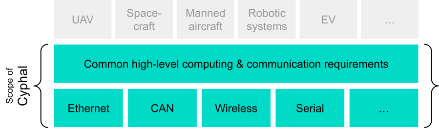

# Introduction

## What is Cyphal?

From [opencyphal.org](https://opencyphal.org/):

> Cyphal is an open technology for real-time intravehicular distributed computing and communication based on modern networking standards (Ethernet, CAN FD, etc.). It was created to address the challenge of on-board deterministic computing and data distribution in next-generation intelligent vehicles: manned and unmanned aircraft, spacecraft, robots and cars.
>
> Features:
> - Designed for complex, high-integrity, real-time vehicular computing systems
> - Publish/subscribe and request/response (RPC) exchange semantics
> - Specialized interface description language provides rich zero-cost interface abstractions and facilitates service-oriented design.
> - Lightweight -- implementable from scratch in ca. 1000 logical lines of code; cheap to verify and validate.
> - Peer-to-peer network -- no bus master, no single point of failure.
> - Modular  redundancy for fault-tolerant systems with automatic fail-over
> - Different transport-layer protocols (Ethernet, CAN, etc.), including heterogeneous transport redundancy.
> - High-quality open source reference implementations are freely available under the MIT license.

## Why do I need Cyphal?

> Modern vehicles are becoming increasingly complex as they implement advanced autonomy and safety capabilities. Most of the complexity is concentrated around the on-board software which largely defines the functional capabilities of the vehicle, yielding the concept of a "software-defined vehicle". This is especially true for unmanned transport.
>
> Cyphal is a response to the unmet demand for a distributed computing that allows the designer to hide the complexity of the components of the on-board intelligence behind well-formalized API while not compromising on functional safety and the costs of verification and validation. 

## Examples

- [L3X-Z](https://github.com/107-systems/l3xz): "A mixed electric/hydraulic hexapod robot"
- [VTOL 1](https://www.youtube.com/watch?v=ss4_Owk5sqo&ab_channel=AutonomousLaboratory)
- [VTOL 2](https://www.youtube.com/watch?v=slXqK8aNwUo&t=57s&ab_channel=AndrewSabadash)

## Components

- [RaccoonLab](https://docs.raccoonlab.co/guide/)
- [Zubax Robotics](https://zubax.com/products)